

# 🚀 Aplicación BPM para la Automatización de Penalizaciones Logísticas

### Trabajo Fin de Grado | Ingeniería Informática

**Universidad Europea del Atlántico**

**Autora:** Lydia García Rivero

---

Aplicación desarrollada sobre **AuraQuantic** para automatizar la gestión de penalizaciones logísticas mediante **Business Process Management (BPM)** e **Inteligencia Artificial**.

---

# 📑 Índice

- [🏭 Contexto del proyecto](#-contexto-del-proyecto)
- [🎯 Objetivos](#-objetivos)
- [🛠 Tecnologías utilizadas](#-tecnologías-utilizadas)
- [📚 Marco teórico](#-marco-teórico)
- [📋 Requerimientos](#-requerimientos)
- [🏗 Análisis y diseño](#-análisis-y-diseño)
- [⚙️ Desarrollo de la solución](#️-desarrollo-de-la-solución)
- [📊 Resultados](#-resultados)
- [🚀 Líneas futuras](#-líneas-futuras)

---

# 🏭 Contexto del proyecto

Este proyecto fue desarrollado durante las prácticas curriculares realizadas en **Andros La Serna**, empresa perteneciente al grupo **Andros**, especializada en la fabricación y distribución de productos lácteos y postres refrigerados.

En su actividad diaria, la empresa trabaja con diferentes operadores logísticos encargados del transporte de mercancías. Cuando durante una entrega se detecta una incidencia, el operador envía una **penalización** mediante correo electrónico indicando la información del pedido afectado, el cliente, los productos implicados y el motivo de la incidencia.

Hasta el momento, la gestión de estas penalizaciones se realizaba de forma completamente manual. Los empleados debían revisar cada correo recibido, interpretar su contenido e introducir toda la información en hojas de cálculo para posteriormente realizar el seguimiento de cada incidencia.

Este procedimiento presentaba diferentes inconvenientes:

- Elevado tiempo de gestión.
- Introducción manual de datos.
- Mayor probabilidad de errores.
- Escasa trazabilidad.
- Información distribuida entre distintos sistemas.

Con el objetivo de mejorar este proceso se desarrolló una aplicación basada en **Business Process Management (BPM)** utilizando la plataforma **AuraQuantic**, capaz de automatizar la recepción de correos electrónicos, analizar automáticamente su contenido mediante **Azure AI Document Intelligence** y generar incidencias listas para su gestión.

---

# 🎯 Objetivos

## Objetivo general

Desarrollar una aplicación BPM capaz de automatizar la gestión de penalizaciones logísticas, reduciendo el trabajo manual y mejorando la eficiencia del proceso.

## Objetivos específicos

- Automatizar la recepción de correos electrónicos.
- Eliminar la introducción manual de datos.
- Extraer automáticamente la información mediante Inteligencia Artificial.
- Crear incidencias automáticamente.
- Centralizar toda la información en una única aplicación.
- Mejorar la trazabilidad del proceso.
- Reducir el tiempo de gestión.
- Minimizar errores humanos.

---

# 🛠 Tecnologías utilizadas

| Tecnología | Descripción |
|------------|-------------|
| **AuraQuantic** | Plataforma Low-Code para el desarrollo de procesos BPM. |
| **Azure AI Document Intelligence** | Servicio de Inteligencia Artificial para el análisis de documentos. |
| **REST API** | Comunicación entre AuraQuantic y Azure. |
| **Microsoft Azure** | Plataforma cloud utilizada para los servicios de IA. |
| **Business Process Management (BPM)** | Metodología utilizada para modelar y automatizar procesos. |
| **PDF** | Conversión automática de los correos electrónicos para su procesamiento. |

---

# 📚 Marco teórico

## Business Process Management (BPM)

Business Process Management (BPM) es una metodología orientada al análisis, modelado, automatización y mejora continua de procesos empresariales.

En este proyecto constituye la base sobre la que se diseña todo el flujo de gestión de penalizaciones, permitiendo automatizar tareas repetitivas y mejorar la eficiencia del proceso.

---

## AuraQuantic

AuraQuantic es una plataforma **Low-Code** especializada en la automatización de procesos empresariales.

Toda la aplicación desarrollada en este proyecto ha sido implementada utilizando esta plataforma, permitiendo modelar procesos, diseñar formularios, gestionar datos e integrar servicios externos.

Con AuraQuantic se han desarrollado:

- Procesos automáticos.
- Formularios.
- Gestión de incidencias.
- Maestros de clientes y artículos.
- Automatización del flujo completo.

---

## Azure AI Document Intelligence

Para automatizar la lectura de los correos electrónicos se ha utilizado **Azure AI Document Intelligence**, un servicio de Microsoft Azure basado en Inteligencia Artificial capaz de analizar documentos y extraer información estructurada.

Tras entrenar el modelo con ejemplos reales de penalizaciones, el sistema es capaz de identificar automáticamente los campos necesarios para crear las incidencias.

---

# 📋 Requerimientos

## Requerimientos funcionales

- Recuperación automática de correos.
- Procesamiento mediante Inteligencia Artificial.
- Creación automática de incidencias.
- Gestión de estados.
- Asignación de responsables.
- Consulta de incidencias.
- Gestión de clientes.
- Gestión de artículos.

## Requerimientos no funcionales

- Escalabilidad.
- Seguridad.
- Rendimiento.
- Disponibilidad.
- Usabilidad.
- Mantenibilidad.

---

# 🏗 Análisis y diseño

Antes del desarrollo de la aplicación fue necesario analizar el procedimiento utilizado por la empresa para gestionar las penalizaciones logísticas.

El primer paso consistió en estudiar los correos electrónicos enviados por el operador logístico **STEF**, ya que estos constituían la fuente principal de información para la creación de las incidencias.

Cada correo contenía información relacionada con el pedido, el cliente, el producto afectado y el motivo de la penalización. Sin embargo, la información se presentaba en un formato no estructurado, lo que obligaba a los empleados a revisar manualmente cada mensaje e introducir posteriormente los datos en hojas de cálculo.

A continuación se muestra un ejemplo de uno de los correos electrónicos recibidos durante el proceso de análisis:

      

Tras el análisis de múltiples correos se identificaron los campos relevantes que debían extraerse automáticamente, permitiendo definir la estructura de datos utilizada posteriormente por la aplicación.

Durante esta fase también se detectaron diferentes situaciones que la solución debía contemplar:

- Correos con formatos diferentes.
- Campos incompletos.
- Varias incidencias dentro de un mismo correo.
- Diferentes tipos de penalización.

Como resultado de esta fase se elaboraron diferentes diagramas UML para representar la arquitectura y el funcionamiento del sistema:

- Diagrama de contexto.
  

- Diagrama de casos de uso.

- Diagrama de actividades.

- Diagrama de clases.

- Diagrama de objetos.

- Diagrama de secuencia.

---

# ⚙️ Desarrollo de la solución

Tras finalizar la fase de análisis y diseño, se desarrolló una aplicación sobre **AuraQuantic** capaz de automatizar el proceso completo de gestión de penalizaciones logísticas.

La solución está formada por tres procesos principales que trabajan de forma coordinada para recibir los correos electrónicos, analizar automáticamente su contenido y generar incidencias dentro de la aplicación.

## Arquitectura general

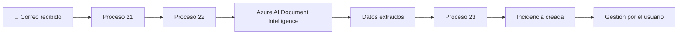

---

# 📧 Proceso 21 - Recuperación de correos electrónicos

El **Proceso 21** constituye el punto de entrada de la automatización. Su función es recuperar automáticamente los correos electrónicos de penalizaciones recibidos en el buzón corporativo y preparar la información necesaria para que los procesos posteriores puedan analizarla y generar las incidencias correspondientes.

La ejecución del proceso se realiza de forma completamente automática mediante una tarea programada, eliminando la necesidad de intervención manual y garantizando la recuperación periódica de los nuevos correos recibidos.

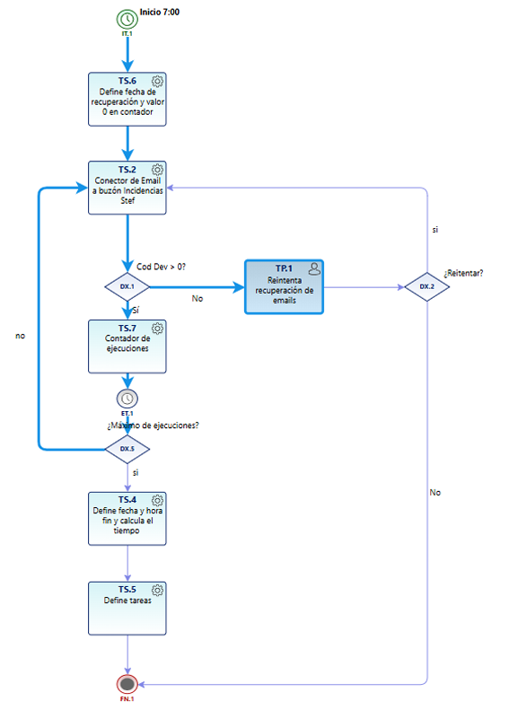

## Funcionamiento del proceso

| Actividad | Descripción |
|-----------|-------------|
| **Inicio programado** | El proceso se ejecuta automáticamente todos los días a las **07:00 horas**. |
| **Inicialización** | Se inicializan las variables necesarias, como la fecha de recuperación y el contador de ejecuciones. |
| **Conexión al buzón** | AuraQuantic establece la conexión con el buzón destinado a las penalizaciones y recupera los correos pendientes. |
| **Comprobación** | Se verifica que la recuperación se ha realizado correctamente. |
| **Gestión de errores** | Si ocurre algún problema, el responsable puede revisar la incidencia y decidir si desea reintentar la recuperación. |
| **Control de ejecuciones** | El sistema incrementa el contador y comprueba si se ha alcanzado el número máximo de ciclos configurados. |
| **Finalización** | Se registra la fecha y hora de finalización del proceso. |
| **Generación de tareas** | Los correos recuperados se envían automáticamente al **Proceso 22**, encargado de su análisis mediante Azure AI Document Intelligence. |

### Gestión de errores

En caso de producirse un error durante la recuperación de los correos, la aplicación muestra una pantalla con el código de devolución correspondiente, permitiendo al responsable decidir entre volver a intentar la operación o finalizar el proceso.

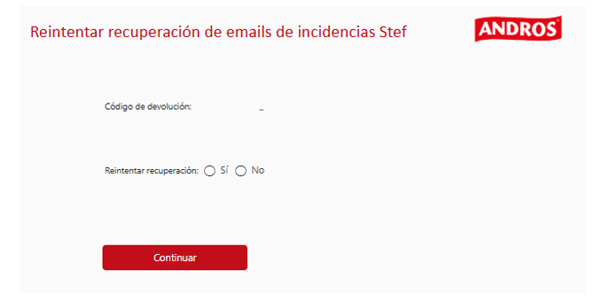

---

# 🤖 Proceso 22 - Extracción automática de información

El **Proceso 22** constituye el núcleo de la solución desarrollada, ya que es el encargado de transformar los correos electrónicos recuperados en información estructurada lista para ser utilizada por la aplicación.

Para ello, el proceso recibe los correos electrónicos obtenidos por el **Proceso 21**, convierte automáticamente su contenido en un documento PDF y establece la comunicación con **Azure AI Document Intelligence** mediante una API REST. Una vez finalizado el análisis, los datos obtenidos son procesados y enviados al **Proceso 23**, donde se generará automáticamente la incidencia correspondiente.

    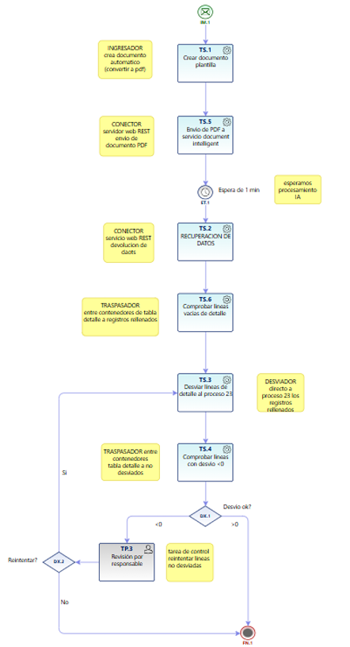

---

# Funcionamiento del proceso

El proceso está compuesto por varias actividades que permiten analizar automáticamente cada uno de los correos electrónicos recibidos.

| Actividad | Descripción |
|-----------|-------------|
| 📥 Recepción del correo | Se recibe el correo enviado desde el Proceso 21. |
| 📄 Conversión a PDF | El contenido del correo se convierte automáticamente a formato PDF. |
| 📤 Envío a Azure | El documento se envía mediante una petición HTTP POST al modelo de Azure AI Document Intelligence. |
| 🤖 Procesamiento | Azure analiza el documento utilizando el modelo previamente entrenado. |
| 📥 Recuperación del resultado | Se realiza una petición HTTP GET para recuperar el resultado del análisis. |
| ✅ Validación | Se comprueba que la información obtenida sea correcta. |
| 📋 Generación de tareas | Los datos extraídos se envían al Proceso 23 para la creación automática de la incidencia. |

---

# 📄 Conversión del correo electrónico a PDF

El primer paso consiste en transformar automáticamente el correo electrónico recibido en un documento PDF.

Esta conversión es necesaria porque **Azure AI Document Intelligence** procesa documentos estructurados y permite obtener mejores resultados cuando el contenido se encuentra en este formato.

    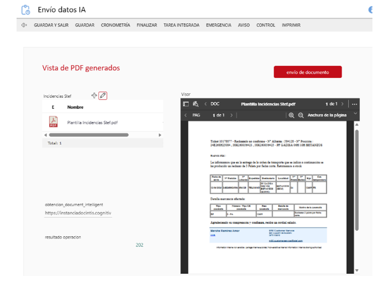

---

# 🌐 Comunicación con Azure AI Document Intelligence

Una vez generado el documento PDF, AuraQuantic establece la comunicación con **Azure AI Document Intelligence** utilizando su API REST.

La integración se realiza mediante dos peticiones HTTP:

- **POST**, utilizada para enviar el documento que será analizado.
- **GET**, utilizada para consultar el resultado una vez finalizado el procesamiento.

---

## 📤 Petición POST

La petición **POST** inicia el análisis del documento.

AuraQuantic envía el PDF generado junto con la información necesaria para que Azure procese el documento utilizando el modelo previamente entrenado.

Como respuesta, Azure devuelve un identificador de operación (*Operation-Location*), que será utilizado posteriormente para consultar el estado del análisis.

    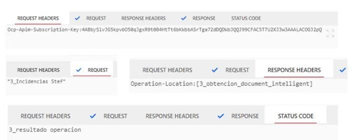

---

## 📥 Petición GET

Una vez iniciado el análisis, AuraQuantic realiza periódicamente una petición **GET** utilizando el identificador de operación devuelto anteriormente.

Cuando el procesamiento finaliza, Azure devuelve un documento JSON con toda la información extraída automáticamente.

    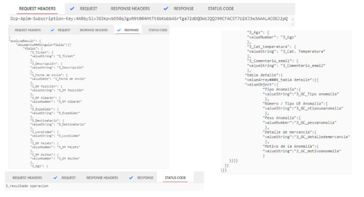

---

# 🧠 Entrenamiento del modelo

Antes de poner en funcionamiento la aplicación fue necesario entrenar un modelo específico de **Azure AI Document Intelligence** utilizando ejemplos reales de penalizaciones logísticas.

Durante este proceso se etiquetaron manualmente todos los campos que posteriormente debían identificarse automáticamente en los documentos recibidos.

---

# 📊 Resultado del análisis

Una vez finalizado el procesamiento, Azure devuelve toda la información identificada en formato estructurado.

---

# 📋 Información extraída

El modelo entrenado es capaz de identificar automáticamente los principales datos contenidos en las penalizaciones logísticas.

Entre ellos destacan:

- Número de ticket.
- Fecha de la incidencia.
- Número de albarán.
- Cliente.
- Destinatario.
- Referencia del producto.
- Cantidad.
- Palés.
- Bultos.
- Peso.
- Temperatura.
- Tipo de anomalía.
- Motivo de la penalización.
- Observaciones.
- Información logística adicional.

En total, el modelo identifica **17 campos**, permitiendo automatizar completamente el registro de la información y eliminando la necesidad de introducir los datos manualmente.

---

> **Resultado del proceso:** una vez validada toda la información, los datos obtenidos se envían automáticamente al **Proceso 23**, encargado de generar la incidencia dentro de la aplicación.

---

# 💾 Proceso 23 - Creación automática de incidencias

El **Proceso 23** es el encargado de recibir la información obtenida por **Azure AI Document Intelligence** y transformarla en una incidencia registrada dentro de la aplicación desarrollada en AuraQuantic.

Una vez recibidos los datos, el proceso realiza las validaciones necesarias, genera el identificador de la incidencia y almacena toda la información para que pueda ser gestionada posteriormente por los usuarios.

    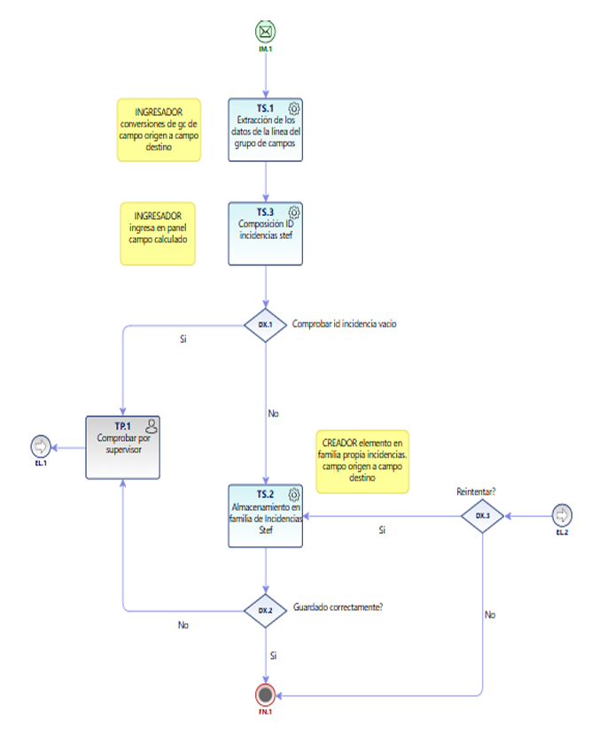

---

## Funcionamiento del proceso

| Actividad | Descripción |
|-----------|-------------|
| 📥 Recepción de datos | Se reciben los datos extraídos por Azure AI Document Intelligence. |
| 🔄 Transformación | La información se adapta al modelo de datos utilizado por AuraQuantic. |
| ✅ Validación | Se comprueba que todos los datos necesarios estén presentes y sean correctos. |
| 📝 Creación de la incidencia | Se genera automáticamente una nueva incidencia dentro de la aplicación. |
| 🆔 Asignación de identificador | Se asigna un identificador único para facilitar su seguimiento. |
| 💾 Almacenamiento | La información queda registrada en la base de datos. |
| 🏁 Finalización | La incidencia queda creada correctamente y disponible para su gestión. |

---

## Gestión de errores

Si durante la creación de la incidencia se produce algún error, AuraQuantic genera una tarea de supervisión que permite al responsable revisar el problema y decidir cómo continuar.

El usuario puede:

- 🔄 Reintentar la creación de la incidencia.
- ⏹️ Finalizar el proceso si no desea volver a intentarlo.

    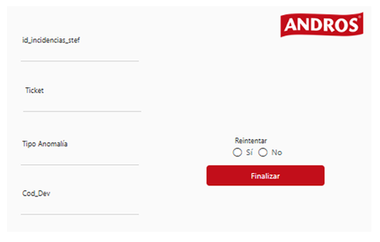

---

> **Resultado del proceso:** la incidencia queda registrada automáticamente dentro de la aplicación y preparada para ser gestionada por los usuarios.

# 🖥️ Gestión de incidencias

Una vez creada, la incidencia queda registrada automáticamente dentro de la aplicación.

Desde esta pantalla los usuarios pueden:

- Consultar todas las incidencias.
- Asignar responsables.
- Actualizar el estado.
- Revisar la información extraída.
- Añadir observaciones.

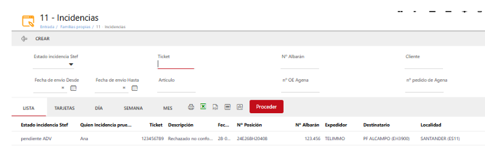

Cada incidencia dispone además de una vista detallada donde se muestra toda la información obtenida durante el procesamiento.

---

# 📚 Gestión de maestros

La aplicación incorpora dos módulos adicionales que permiten consultar información relacionada con las incidencias.

## Maestro de artículos

Permite consultar toda la información referente a los productos registrados en el sistema.

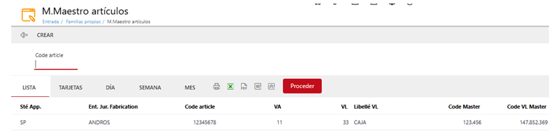

---

## Maestro de clientes

Permite acceder a la información de todos los clientes registrados.

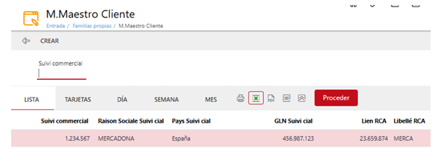

---

# 📊 Resultados

La solución desarrollada ha permitido automatizar completamente la fase inicial del proceso de gestión de penalizaciones.

| Indicador | Resultado |
|-----------|-----------|
| Correos procesados automáticamente | ✅ |
| Extracción automática de datos | ✅ |
| Creación automática de incidencias | ✅ |
| Campos identificados | **17** |
| Centralización de la información | ✅ |
| Reducción del trabajo manual | ✅ |

Los resultados obtenidos muestran una mejora significativa en la eficiencia del proceso, reduciendo el tiempo dedicado a tareas repetitivas y mejorando la trazabilidad de las incidencias.

---

# 🚀 Líneas futuras

Aunque la aplicación cumple con los objetivos definidos inicialmente, existen diferentes líneas de evolución que permitirían ampliar sus funcionalidades:

- Integración con el ERP **Agena**.
- Integración con **Telifrai**.
- Automatización del proceso completo de validación de penalizaciones.
- Incorporación de cuadros de mando con indicadores.
- Generación automática de informes.
- Nuevos procesos BPM para otras áreas de la empresa.

---

## 👩‍💻 Autora

**Lydia García Rivero**

Grado en Ingeniería Informática

Universidad Europea del Atlántico

---

⭐ Gracias por visitar este proyecto.

